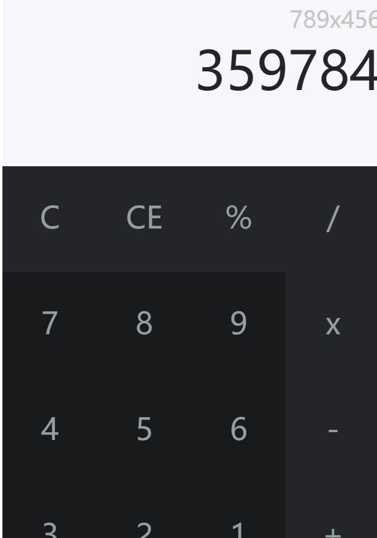

# app-ideas

This is a repository to finish the project of [app-ideas](https://github.com/florinpop17/app-ideas).

[**Bin2Dec**](/Bin2Dec):

This is a converter that converts binary numbers to decimal numbers.

[**Calculator**](/Calculator):

This is a simple calculator.

[**Color CyCle: **](/Color Cycle)

This is a project to use CSS to change the color of body.